# Body Measurements Workflow — AI Precision Fit

Tài liệu chi tiết về giải thuật và quy trình trích xuất số đo nhân trắc học 3D (**Anthropometric Body Measurement Engine**) từ 2 ảnh 2D (Front + Side) trong hệ thống AI Precision Fit.

---

## 1. Mục tiêu & Nguyên lý cốt lõi

Quy trình giải quyết bài toán: **Từ 2 bức ảnh 2D thông thường, tính toán chính xác 6 số đo nhân trắc học chủ chốt theo cm mà không cần máy quét 3D đắt tiền (3D Body Scanner) hay mô hình mesh SMPL-X cồng kềnh.**

- **Độ chính xác mục tiêu:** MAE (Mean Absolute Error) $\le 1.72\text{ cm}$ cho chế độ 2 góc ảnh (Dual-view), $\le 2.30\text{ cm}$ khi chụp 1 ảnh (Single-view fallback).
- **Thời gian xử lý:** $< 80\text{ ms}$ trên CPU.
- **Quy tắc an toàn (Fail-safe):** Xác thực nghiêm ngặt bằng Pydantic Model (`BodyMeasurements`) để chặn các giá trị vô lý.

---

## 2. Quy trình trích xuất số đo (Architecture Flowchart)

```mermaid
flowchart TD
    Start(["📥 Nhận front_image_bytes, side_image_bytes (tùy chọn)<br/>Chiều cao (known_height_cm), Cân nặng, Giới tính, Tuổi"]) --> Step1["1. Giải mã ảnh & Phát hiện Pose<br/>- MediaPipe Pose Single-Pass trích xuất 33 Landmarks"]

    Step1 --> Step2["2. Hiệu chuẩn tỷ lệ Pixel-to-Metric (P2M Scale)<br/>- Xác định Đỉnh đầu (Crown) & Gót chân (Heel/Ankle)<br/>- Tính pixel_height = |heel_y - crown_y| * H<br/>- p2m_scale = known_height_cm / pixel_height (cm/px)"]

    Step2 --> Step3["3. Đo các cung xương tuyến tính (Linear Bones)<br/>- Rộng vai (Shoulder): Landmarks 11-12 &times; 1.10 (cơ delta)<br/>- Dài tay (Arm): 11&rarr;13&rarr;15 và 12&rarr;14&rarr;16 (trung bình 2 tay)<br/>- Dài chân (Inseam): Điểm đũng quần &rarr; Gối 25,26 &rarr; Mắt cá 27,28"]

    Step3 --> Step4["4. Định vị các lát cắt cơ thể (Torso Slices Geometry)<br/>- Trọng tâm thân (cx, cy), Chiều dài thân torso_h<br/>- Vị trí Ngực: y_shoulder + 0.22*torso_h<br/>- Vị trí Eo: y_shoulder + 0.62*torso_h<br/>- Vị trí Hông: y_hip + 0.12*torso_h"]

    Step4 --> Step5["5. Trích xuất bán trục ngang ảnh thẳng (Semi-major axis: a)<br/>- Quét biên độ Sobel Gradient ngang tại lát cắt (extract_slice_width_px)<br/>- a_chest = (w_chest_px * p2m) / 2<br/>- a_waist = (w_waist_px * p2m) / 2<br/>- a_hips = (w_hips_px * p2m) / 2"]

    Step5 --> CheckSide{"Có ảnh chụp nghiêng<br/>(side_image_bytes) hợp lệ?"}

    CheckSide -- "✅ Có (Dual-View Stereometry)" --> Step6A["6A. Trích xuất trực tiếp bán trục sâu (Semi-minor axis: b)<br/>- MediaPipe Pose trên side_img &rarr; p2m_side<br/>- Quét Sobel viền bụng/lưng tại cùng tọa độ tương đối<br/>- b_chest, b_waist, b_hips"]

    CheckSide -- "❌ Không (Single-View Fallback)" --> Step6B["6B. Hồi quy bán trục sâu qua Anthropometric Priors<br/>- Tính BMI = weight / (height^2)<br/>- Tích hợp hệ số nhân trắc theo Giới tính & Tuổi<br/>- b = a &times; prior_depth_ratio(BMI, gender)"]

    Step6A --> Step7["7. Tính chu vi 3 vòng bằng Công thức Elip Ramanujan<br/>C &asymp; &pi; &times; [ 3(a + b) - &radic;((3a + b)(a + 3b)) ]<br/>- chest_cm, waist_cm, hips_cm"]
    Step6B --> Step7

    Step7 --> Step8["8. Tính Benchmark-Calibrated Confidence Score<br/>- Dual-view baseline: 93.3% | Single-view baseline: 87.5%<br/>- Điều chỉnh theo độ rõ nét Landmark & Tỷ lệ giải phẫu (WHR, S/H)"]

    Step8 --> Step9["9. Phân loại dáng người (Body Shape) & Smart Fit Notes<br/>- Nữ: Đồng hồ cát, Quả lê, Quả táo, Chữ nhật, Tam giác ngược<br/>- Nam: Hình thang, Hình chữ nhật, Tam giác, Tam giác ngược, Oval<br/>- Khuyến nghị form áo/quần phù hợp"]

    Step9 --> End(["📤 Trả về MeasurementResponse<br/>(BodyMeasurements, BodyShape, Confidence, Latency)"])
```



---

## 3. Chi tiết 6 bước tính toán cốt lõi

### Bước 1: Hiệu chuẩn tỷ lệ Pixel-to-Metric (P2M Calibrator)
Tỷ lệ scale là chiếc chìa khóa để chuyển đổi khoảng cách pixel trong ảnh thành centimet thực tế:
$$\text{crown\_y} = \text{nose.y} - \max(0.04, \; |\text{ear\_y} - \text{nose.y}| \times 2.2)$$
$$\text{pixel\_height} = |\text{heel\_y} - \text{crown\_y}| \times H$$
$$\text{p2m\_scale} = \frac{\text{known\_height\_cm}}{\text{pixel\_height}} \quad (\text{cm / pixel})$$

### Bước 2: Đo chiều dài xương tuyến tính (Linear Bones)
- **Rộng vai ($\text{shoulder\_cm}$):** Khoảng cách Euclidean giữa 2 mỏm cùng vai (Landmarks 11 & 12), nhân hệ số **$1.10$** để bù trừ độ cong của cơ delta hai bên cánh tay:
  $$\text{shoulder\_cm} = \text{Euclidean}(P_{11}, P_{12}) \times \text{p2m\_scale} \times 1.10$$
- **Dài tay ($\text{arm\_length\_cm}$):** Tính trung bình tổng khoảng cách 3 khớp: Vai ($11,12$) $\to$ Khuỷu tay ($13,14$) $\to$ Cổ tay ($15,16$).
- **Dài chân ($\text{inseam\_cm}$):** Từ điểm đáy đáy đũng quần (nằm giữa 2 xương chậu $23,24$) $\to$ Đầu gối ($25,26$) $\to$ Mắt cá chân ($27,28$).

### Bước 3: Trích xuất lát cắt cơ thể bằng Sobel Gradient
Thay vì dùng tỉ lệ cố định, hệ thống quét ma trận ảnh Grayscale tại độ cao $y$ của lát cắt bằng toán tử đạo hàm ngang **Sobel-X** ($ksize=3$):
$$\text{Sobel}_X(x, y) = \frac{\partial I}{\partial x}$$
- Quét từ tâm cơ thể ($c_x$) sang trái và sang phải. Điểm có $|\text{Sobel}_X| > 12$ đạt cực đại chính là viền cơ thể (silhouette edge).
- Bề rộng lát cắt: $w_{\text{slice}} = \text{edge}_{\text{left}} + \text{edge}_{\text{right}}$.
- Bán trục ngang: $a = \frac{w_{\text{slice}} \times \text{p2m\_scale}}{2}$.

### Bước 4: Đo bề sâu cơ thể (Dual-View vs Hybrid Prior Fallback)
Mỗi vòng đo (ngực, eo, hông) được mô hình hóa thành một **hình Elip** với 2 bán trục:
- Bán trục ngang $a$: Thu được từ ảnh chính diện (Front view).
- Bán trục sâu $b$: 
  - **Khi có ảnh nghiêng (Side view):** Quét trực tiếp viền trước ngực/bụng và sau lưng tại cùng độ cao tương đối để lấy $b = \frac{\text{depth}_{\text{px}} \times \text{p2m\_side}}{2}$.
  - **Khi chỉ có 1 ảnh (Single-view):** Dùng mô hình hồi quy nhân trắc học kết hợp chỉ số khối cơ thể $\text{BMI} = \frac{W_{\text{kg}}}{(H_{\text{m}})^2}$ và giới tính để ước tính tỉ lệ $b/a$.

### Bước 5: Tính chu vi 3 vòng bằng Công thức Elip Ramanujan
Chu vi hình elip không thể biểu diễn bằng hàm giải tích cơ bản thông thường. Hệ thống ứng dụng **công thức xấp xỉ bậc cao thứ hai của Ramanujan** với sai số $< 0.05\%$:

$$C \approx \pi \times \left[ 3(a + b) - \sqrt{(3a + b)(a + 3b)} \right]$$

Áp dụng lần lượt cho:
1. **Vòng ngực ($\text{chest\_cm}$):** Lát cắt tại vị trí $y_{\text{shoulder}} + 0.22 \times \text{torso\_h}$.
2. **Vòng eo ($\text{waist\_cm}$):** Lát cắt tại vị trí $y_{\text{shoulder}} + 0.62 \times \text{torso\_h}$.
3. **Vòng hông ($\text{hips\_cm}$):** Lát cắt tại vị trí $y_{\text{hip}} + 0.12 \times \text{torso\_h}$.

### Bước 6: Phân loại dáng người (Rule-based Body Shape Classification)
Hệ thống sử dụng hệ thống luật chuẩn nhân trắc học quốc tế:

| Giới tính | Dáng người | Điều kiện nhận diện chính |
| :--- | :--- | :--- |
| **Nữ** | **Đồng hồ cát** (`dong_ho_cat`) | $WHR \le 0.75$, $|Chest - Hips| \le 6\text{ cm}$, $(Chest - Waist) \ge 15\text{ cm}$ |
| | **Quả lê** (`qua_le`) | $Hips \ge Chest + 5\text{ cm}$, $WHR \le 0.82$ |
| | **Quả táo** (`qua_tao`) | $WHR \ge 0.85$ hoặc $Waist \ge Chest - 3\text{ cm}$ |
| | **Tam giác ngược** (`tam_giac_nguoc`) | $Chest \ge Hips + 5\text{ cm}$ hoặc $Shoulder \ge Hips \times 0.44$ |
| | **Hình chữ nhật** (`chu_nhat`) | Ba vòng tương đương, eo ít thắt |
| **Nam** | **Hình thang** (`hinh_thang`) | Dáng chuẩn: $Chest \ge Waist + 6\text{ cm}$, $Chest \ge Hips - 2\text{ cm}$ |
| | **Tam giác ngược** (`tam_giac_nguoc`) | Dáng V-Taper: $Chest \ge Waist + 15\text{ cm}$, vai $\ge 44\text{ cm}$ |
| | **Hình chữ nhật** (`chu_nhat`) | Vai, ngực và eo ngang nhau ($WCR \ge 0.88$) |
| | **Hình tam giác** (`tam_giac`) | Hông/bụng to hơn ngực ($Hips \ge Chest$) |
| | **Hình Oval** (`oval`) | Bụng lớn vượt trội ($Waist > Chest$ và $Waist > Hips$) |

---

## 4. Bảng kiểm tra Pydantic Validation Bounds

Để ngăn ngừa triệt để các lỗi dị thường (Anomalous outliers), dữ liệu đầu ra được bảo vệ bằng schema `BodyMeasurements`:

```python
height_cm: float = Field(ge=120.0, le=230.0)
weight_kg: float = Field(ge=30.0, le=200.0)
shoulder_cm: float = Field(ge=25.0, le=70.0)
chest_cm: float = Field(ge=50.0, le=160.0)
waist_cm: float = Field(ge=40.0, le=150.0)
hips_cm: float = Field(ge=50.0, le=160.0)
arm_length_cm: float = Field(ge=30.0, le=100.0)
inseam_cm: float = Field(ge=40.0, le=120.0)
```
