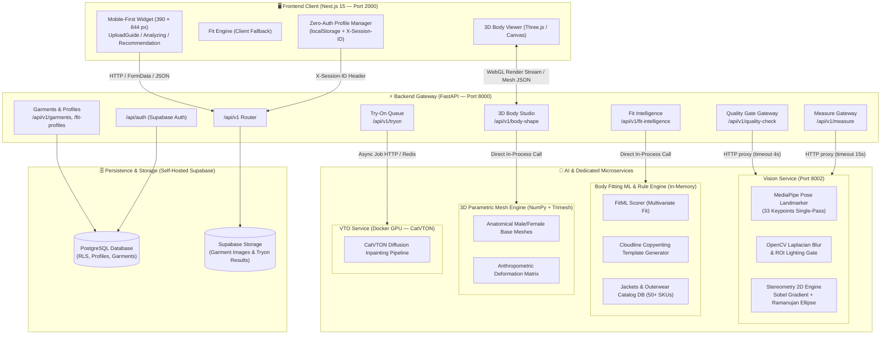
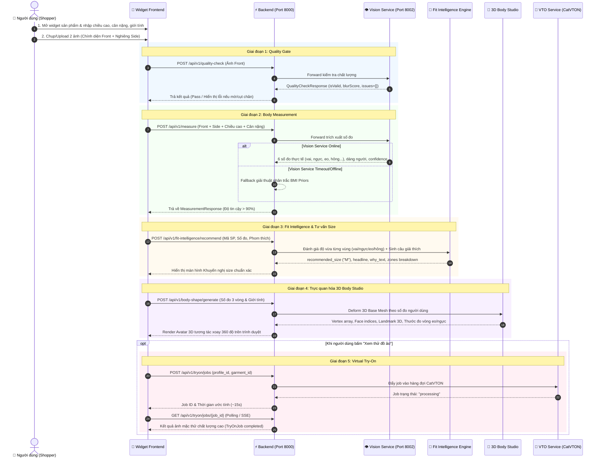

# Main Architecture & Pipeline Workflow — AI Precision Fit

Tài liệu thiết kế kiến trúc tổng thể, quy trình vận hành luồng xử lý (**End-to-End Pipeline Workflow**) và đặc tả chi tiết toàn bộ các **API Endpoints** trong hệ thống **AI Precision Fit & Virtual Try-On**.

---

## 1. Tổng quan Dự án & Mục tiêu Thiết kế

**AI Precision Fit** là giải pháp widget thông minh hỗ trợ người dùng mua sắm thời trang trực tuyến với độ chính xác cao:
- **Zero-Auth Multi-Profile:** Lưu trữ và chuyển đổi linh hoạt nhiều hồ sơ số đo (`localStorage` kết hợp đồng bộ Supabase RLS qua `X-Session-ID`).
- **Edge Quality Gate:** Bộ lọc kiểm soát chất lượng ảnh chụp toàn thân bằng CPU (độ trễ $\le 30\text{ ms}$), loại bỏ hoàn toàn ảnh mờ, tối, cụt đầu/chân hoặc sai tư thế trước khi tính toán.
- **Anthropometric 2D-to-3D Measurement:** Ước tính 6 số đo nhân trắc học chủ chốt (vai, ngực, eo, hông, dài tay, dài chân) từ 2 ảnh 2D (Front + Side) bằng giải thuật Sobel Silhouette Edge kết hợp công thức Ramanujan Ellipse ($\text{MAE} \le 1.72\text{ cm}$).
- **Fit Intelligence & Explanation Engine:** Đánh giá độ vừa vặn đa vùng (Vai, Ngực, Eo, Hông, Dài áo) theo từng size sản phẩm, sinh lời giải thích trực quan bằng tiếng Việt và so sánh trực diện 2 size áo cạnh nhau.
- **Realistic 3D Body Studio:** Tạo mô hình 3D Parametric theo số đo thực tế của người dùng, hiển thị thước đo trực quan trên trình duyệt (Three.js WebGL).
- **Virtual Try-On (CatVTON):** Microservice chạy trên GPU độc lập phục vụ render ảnh mặc thử ảo.

---

## 2. Kiến trúc Hệ thống Tổng thể (System Architecture)



---

## 3. Sơ đồ Tuần tự Hành trình Người dùng (End-to-End Sequence Diagram)



---

## 4. Danh mục API Endpoints Tổng quan

| Phân nhóm API | HTTP Method & Path | Mục đích chính | Service xử lý |
| :--- | :--- | :--- | :--- |
| **Quality Gate** | `POST /api/v1/quality-check` | Kiểm tra ảnh đạt chuẩn (mờ, sáng, cụt đầu/chân, tư thế) | `vision-service` (CPU) |
| | `POST /api/v1/quality-check/upload` | Upload multipart file trực tiếp để kiểm tra ảnh | `vision-service` (CPU) |
| **Body Measurement** | `POST /api/v1/measure` | Đo 6 kích thước nhân trắc học 3D từ ảnh Front + Side | `vision-service` (CPU) |
| | `POST /api/v1/measure/upload` | Upload trực tiếp file ảnh để đo số đo cơ thể | `vision-service` (CPU) |
| | `GET /api/v1/engines` | Lấy danh sách các thuật toán đo được hỗ trợ | `vision-service` |
| **Fit Intelligence** | `GET /api/v1/fit-intelligence/health` | Kiểm tra trạng thái module Fit Intelligence | `backend` (in-memory) |
| | `GET /api/v1/fit-intelligence/products` | Lấy danh sách áo khoác & bảng thông số size chart | `backend` (in-memory) |
| | `GET /api/v1/fit-intelligence/products/{id}` | Lấy chi tiết 1 sản phẩm và bảng thông số từng size | `backend` (in-memory) |
| | `POST /api/v1/fit-intelligence/recommend` | Khuyến nghị size chuẩn + giải thích chi tiết tiếng Việt | `backend` (FitMLEngine) |
| | `POST /api/v1/fit-intelligence/compare-sizes` | So sánh trực quan độ vừa giữa 2 size áo cạnh nhau | `backend` (ExplanationEngine) |
| **3D Body Studio** | `GET /api/v1/body-shape/studio` | Giao diện tương tác 3D Web Studio trên Canvas | `backend` (Static HTML) |
| | `GET /api/v1/body-shape/health` | Kiểm tra trạng thái mô hình 3D Parametric | `backend` |
| | `POST /api/v1/body-shape/generate` | Sinh ma trận điểm 3D mesh & thông số giải phẫu | `backend` (Trimesh / NumPy) |
| | `POST /api/v1/body-shape/export/obj` | Xuất file 3D mesh định dạng Wavefront `.obj` | `backend` (Trimesh) |
| **Profiles & Garments** | `GET /api/v1/fit-profiles` | Lấy danh sách hồ sơ đo của phiên (Zero-Auth) | `backend` (Supabase DB) |
| | `POST /api/v1/fit-profiles` | Tạo hồ sơ đo mới cho người dùng | `backend` (Supabase DB) |
| | `GET /api/v1/garments` | Danh sách sản phẩm thời trang trong hệ thống | `backend` (Supabase DB) |
| **Virtual Try-On** | `POST /api/v1/tryon/jobs` | Tạo tiến trình thử đồ ảo với CatVTON | `vto-service` (GPU) |
| | `GET /api/v1/tryon/jobs/{job_id}` | Kiểm tra tiến độ và nhận URL ảnh mặc thử | `vto-service` (GPU) |

---

## 5. Đặc tả Chi tiết Từng API Endpoint

### 5.1. Nhóm Quality Gate

#### 1. POST `/api/v1/quality-check` & `/api/v1/quality-check/upload`
- **Mục đích:** Kiểm tra ảnh chụp toàn thân có hợp lệ hay không trước khi tính toán số đo. Phát hiện các lỗi: không có người, rung mờ (motion blur), thiếu sáng/cháy sáng, bị che khuất thân thể, đứng lệch góc, hoặc bị cắt mất đỉnh đầu/bàn chân.
- **Header:** `Content-Type: application/json` hoặc `multipart/form-data`

##### Request Ví dụ (JSON):
```json
{
  "image_base64": "data:image/jpeg;base64,/9j/4AAQSkZJRgABAQEASABIAAD...",
  "image_type": "front"
}
```

##### Request Ví dụ (Multipart Form-Data qua `/upload`):
- `image`: File ảnh nhị phân (`.jpg`, `.png`)
- `image_type`: `"front"` hoặc `"side"`

##### Response Thành công (HTTP 200 - Đạt chuẩn):
```json
{
  "isValid": true,
  "confidenceScore": 0.98,
  "issues": [],
  "blurScore": 142.58,
  "landmarksDetected": 33
}
```

##### Response Thất bại (HTTP 200 - Có lỗi cần chụp lại):
```json
{
  "isValid": false,
  "confidenceScore": 0.48,
  "issues": [
    {
      "code": "feet_cut_off",
      "severity": "error",
      "message": "Không nhìn thấy bàn chân, vui lòng lùi xa camera để lấy trọn vẹn toàn thân",
      "box": [0.85, 0.2, 1.0, 0.8]
    },
    {
      "code": "blurry",
      "severity": "error",
      "message": "Ảnh bị mờ hoặc rung tay, vui lòng giữ chắc điện thoại khi chụp",
      "box": null
    }
  ],
  "blurScore": 22.4,
  "landmarksDetected": 29
}
```

- **Cơ chế Fail-safe:** Timeout bảo vệ 4.0 giây. Nếu `vision-service` không phản hồi, Backend trả về HTTP 504/503 để Frontend hiển thị thông báo thân thiện mà không gây treo màn hình.

---

### 5.2. Nhóm Body Measurement

#### 2. POST `/api/v1/measure` & `/api/v1/measure/upload`
- **Mục đích:** Trích xuất 6 số đo nhân trắc học chính xác theo centimet (rộng vai, ngực, eo, hông, dài tay, dài chân), tự động phân loại dáng người và đề xuất lưu ý chọn đồ.
- **Header:** `Content-Type: application/json` hoặc `multipart/form-data`
- **Query Params:** `engine` (tùy chọn: `hybrid_stereometry_2d`, mặc định là thuật toán stereometry chuẩn)

##### Request Ví dụ (JSON):
```json
{
  "front_image_base64": "data:image/jpeg;base64,/9j/4AAQSkZJRg...",
  "side_image_base64": "data:image/jpeg;base64,/9j/4AAQSkZJRg...",
  "known_height_cm": 165.0,
  "weight_kg": 56.0,
  "age": 24,
  "gender": "female"
}
```

##### Response Thành công (HTTP 200):
```json
{
  "measurements": {
    "heightCm": 165.0,
    "weightKg": 56.0,
    "shoulderCm": 38.8,
    "chestCm": 86.4,
    "waistCm": 68.2,
    "hipsCm": 92.5,
    "armLengthCm": 56.4,
    "inseamCm": 72.8
  },
  "confidencePercent": 93.3,
  "method": "hybrid_stereometry_2d",
  "bodyShape": "dong_ho_cat",
  "smartFitNotes": [
    "Tỉ lệ eo/hông chuẩn dáng Đồng hồ cát (WHR = 0.74).",
    "Khuyên dùng các mẫu áo khoác chiết eo nhẹ để tôn đường cong cơ thể."
  ],
  "engineId": "hybrid_stereometry_2d",
  "latencyMs": 52.4
}
```

- **Cơ chế Fallback thông minh:** Khi chỉ có 1 ảnh Front (thiếu ảnh Side) hoặc khi `vision-service` gián đoạn kết nối, hệ thống tự động kích hoạt **Anthropometric Hybrid BMI Regression** để ước tính số đo từ chiều cao, cân nặng và phân phối nhân trắc học theo độ tuổi/giới tính (`confidencePercent: 75.0%`), bảo đảm trải nghiệm mua sắm không bao giờ bị đứt đoạn.

---

### 5.3. Nhóm Fit Intelligence & Size Recommendation

#### 3. GET `/api/v1/fit-intelligence/products`
- **Mục đích:** Cung cấp danh mục các sản phẩm thời trang (Jackets, Coats, Blazers...) kèm bảng số đo kích thước chi tiết (Size Chart) để so khớp với người dùng.
- **Query Params:** `brand` (Zara, Uniqlo, H&M...), `category` (phao, dạ, da, blazer...), `gender` (Nữ, Nam, Unisex), `fit_cut` (regular, slim, oversized), `q` (tìm kiếm từ khóa).

##### Response Ví dụ (HTTP 200):
```json
{
  "total": 1,
  "products": [
    {
      "id": "uniqlo_jk_01",
      "brand": "Uniqlo",
      "product_name": "Áo Khoác Phao Siêu Nhẹ Ultra Light Down",
      "category": "Áo phao",
      "gender": "Unisex",
      "price_vnd": 1499000,
      "fit_cut": "regular",
      "stretch": "low",
      "size_chart": {
        "S": { "shoulder": 43, "bust": 104, "waist": 98, "length": 64, "sleeve": 61 },
        "M": { "shoulder": 45, "bust": 110, "waist": 104, "length": 66, "sleeve": 62.5 },
        "L": { "shoulder": 47, "bust": 116, "waist": 110, "length": 68, "sleeve": 64 }
      }
    }
  ]
}
```

---

#### 4. POST `/api/v1/fit-intelligence/recommend`
- **Mục đích:** Tính toán phân tích độ vừa vặn đa chiều của từng vị trí (vai, ngực, eo, hông) dựa trên số đo người dùng và độ co giãn của áo, đưa ra size khuyến nghị chính xác, kèm lời văn giải thích trực quan bằng tiếng Việt.
- **Header:** `Content-Type: application/json`

##### Request Ví dụ:
```json
{
  "product_id": "uniqlo_jk_01",
  "measurements": {
    "height": 165.0,
    "weight": 56.0,
    "shoulder": 39.0,
    "bust": 86.0,
    "waist": 70.0,
    "hip": 92.0
  },
  "fit_preference": "regular"
}
```

##### Response Thành công (HTTP 200):
```json
{
  "product_id": "uniqlo_jk_01",
  "product_name": "Áo Khoác Phao Siêu Nhẹ Ultra Light Down",
  "brand": "Uniqlo",
  "category": "Áo phao",
  "price_vnd": 1499000,
  "recommended_size": "M",
  "alternative_size": "L",
  "confidence": 92.0,
  "confidence_label": "Độ tin cậy 92.0% · Vừa vặn",
  "headline": "Size M là lựa chọn chuẩn xác nhất cho vóc dáng của bạn",
  "why_text": "Phom áo Size M đem lại độ cử động lý tưởng tại vùng ngực và vai (dư 4-6cm), giữ ấm tốt mà không gây gò bó khi mặc thêm áo len bên trong.",
  "zones": {
    "shoulder": { "diff_cm": 6.0, "status": "perfect", "label": "Vừa vặn" },
    "bust": { "diff_cm": 24.0, "status": "perfect", "label": "Thoải mái (đúng phom áo phao)" },
    "waist": { "diff_cm": 34.0, "status": "perfect", "label": "Thoải mái" }
  },
  "advisory": [
    "Nếu bạn thích mặc ôm gọn gàng hơn nữa, có thể cân nhắc Size S.",
    "Nếu thường xuyên mặc kèm áo hoodie dày bên trong, hãy cân nhắc nâng lên Size L."
  ],
  "ml_probabilities": { "S": 0.12, "M": 0.81, "L": 0.07 }
}
```

---

#### 5. POST `/api/v1/fit-intelligence/compare-sizes`
- **Mục đích:** Hỗ trợ màn hình so sánh 2 size áo cạnh nhau (ví dụ: Size M đề xuất vs Size L phụ), giúp người dùng tự tin quyết định trước khi bấm mua hàng.

##### Request Ví dụ:
```json
{
  "product_id": "uniqlo_jk_01",
  "size_a": "M",
  "size_b": "L",
  "measurements": {
    "height": 165.0,
    "weight": 56.0,
    "shoulder": 39.0,
    "bust": 86.0,
    "waist": 70.0,
    "hip": 92.0
  }
}
```

##### Response Thành công (HTTP 200):
```json
{
  "product_name": "Áo Khoác Phao Siêu Nhẹ Ultra Light Down",
  "size_a": {
    "size": "M",
    "badge": "Đề xuất chuẩn",
    "summary": "Vừa vặn lý tưởng cho phom regular",
    "specs": { "shoulder": 45, "bust": 110, "length": 66 }
  },
  "size_b": {
    "size": "L",
    "badge": "Rộng rãi",
    "summary": "Vai rộng hơn 2cm, thân áo thụng hơn, phù hợp layer đồ mùa đông dày",
    "specs": { "shoulder": 47, "bust": 116, "length": 68 }
  },
  "comparison_verdict": "Size M giúp bạn trông gọn gàng và tôn dáng hơn; Size L sẽ mang lại cảm giác thoải mái tối đa khi vận động ngoài trời."
}
```

---

### 5.4. Nhóm Realistic 3D Body Studio

#### 6. POST `/api/v1/body-shape/generate`
- **Mục đích:** Tự động biến dạng lưới hình học 3D (Parametric Base Mesh Deformation) theo giới tính và số đo thực tế của người dùng, trả về tọa độ đỉnh (`vertices`), tam giác mặt (`faces`), pháp tuyến (`normals`) và các vị trí thước đo 3D (`measurement_tapes`) để hiển thị trực tiếp trên WebGL Canvas.
- **Header:** `Content-Type: application/json`

##### Request Ví dụ:
```json
{
  "gender": "female",
  "height_cm": 165.0,
  "weight_kg": 56.0,
  "shoulder_width_cm": 38.8,
  "bust_cm": 86.4,
  "waist_cm": 68.2,
  "hip_cm": 92.5,
  "skin_tone": "natural"
}
```

##### Response Thành công (HTTP 200):
```json
{
  "execution_time_ms": 38.5,
  "body_mesh": {
    "num_vertices": 12560,
    "num_faces": 25116,
    "texture_url": "/static/body_shape/models/female_texture.png",
    "color": [0.88, 0.76, 0.65],
    "vertices": [[0.012, 1.452, -0.035], "..."],
    "faces": [[0, 1, 2], "..."],
    "normals": [[0.0, 0.98, -0.12], "..."]
  },
  "measurement_tapes": [
    { "name": "Bust", "value_cm": 86.4, "center_y": 1.28, "radius_m": 0.14 },
    { "name": "Waist", "value_cm": 68.2, "center_y": 1.05, "radius_m": 0.11 },
    { "name": "Hips", "value_cm": 92.5, "center_y": 0.88, "radius_m": 0.15 }
  ],
  "analysis": {
    "bmi": 20.57,
    "bmi_category": "Normal weight",
    "whr": 0.74,
    "body_shape_type": "dong_ho_cat"
  }
}
```

#### 7. POST `/api/v1/body-shape/export/obj`
- **Mục đích:** Xuất tệp tin 3D chuẩn công nghiệp định dạng Wavefront `.obj` để người dùng hoặc kỹ sư may đo có thể import vào các phần mềm 3D như CLO3D, Blender, Marvelous Designer.
- **Response:** Nhị phân file tải về (`model/obj`), kèm header `Content-Disposition: attachment; filename=human_body_female_165cm.obj`.

#### 8. GET `/api/v1/body-shape/studio`
- **Mục đích:** Phục vụ ứng dụng web con tương tác 3D Body Studio hoàn chỉnh (HTML5/Canvas), cho phép người dùng kéo slider điều chỉnh các thông số cơ thể và quan sát avatar 3D phản hồi theo thời gian thực.

---

### 5.5. Nhóm Profiles & Garment Catalog

#### 9. GET & POST `/api/v1/fit-profiles`
- **Mục đích:** Quản lý danh sách hồ sơ đo lường của khách hàng (ví dụ: "Bản thân", "Mẹ", "Bạn gái", "Chồng") theo cơ chế Zero-Auth thông qua Header `X-Session-ID`.
- **Headers:** `X-Session-ID: demo-shopper-1234`

##### Request POST Tạo Profile:
```json
{
  "name": "Dương (Công sở)",
  "gender": "female",
  "fitPreference": "regular",
  "heightCm": 165.0,
  "weightKg": 56.0,
  "chestCm": 86.0,
  "waistCm": 68.0,
  "hipsCm": 92.0,
  "shoulderCm": 39.0,
  "isDefault": true
}
```

##### Response Thành công (HTTP 200/201):
```json
{
  "id": "prof_9942a1b",
  "name": "Dương (Công sở)",
  "gender": "female",
  "fitPreference": "regular",
  "heightCm": 165.0,
  "weightKg": 56.0,
  "chestCm": 86.0,
  "waistCm": 68.0,
  "hipsCm": 92.0,
  "shoulderCm": 39.0,
  "isVerified": true,
  "isDefault": true,
  "createdAt": "2026-10-03T08:30:00Z"
}
```

---

### 5.6. Nhóm Virtual Try-On (CatVTON)

#### 10. POST `/api/v1/tryon/jobs` & GET `/api/v1/tryon/jobs/{job_id}`
- **Mục đích:** Tạo tác vụ thử đồ ảo chạy nền bằng mô hình CatVTON (Diffusion Inpainting) và truy vấn trạng thái tiến trình.
- **Header:** `Idempotency-Key: uuid-v4-client-key` (tránh submit 2 lần khi mạng chập chờn)

##### Request POST:
```json
{
  "profile_id": "prof_9942a1b",
  "garment_id": "uniqlo_jk_01",
  "person_image_url": "https://storage.local/profiles/front_user.jpg",
  "garment_image_url": "https://storage.local/garments/uniqlo_down.jpg"
}
```

##### Response GET Trạng thái hoàn thành (HTTP 200):
```json
{
  "jobId": "job_vto_88723",
  "status": "completed",
  "resultImageUrl": "https://storage.local/tryon/result_job_vto_88723.jpg",
  "estimatedSeconds": 0,
  "errorMessage": null,
  "createdAt": "2026-10-03T08:31:00Z"
}
```

---

## 6. Bảng Mã Lỗi Chuẩn Hóa Hệ Thống (System Error Reference)

Toàn bộ các API đều tuân thủ định dạng phản hồi lỗi thống nhất:

```json
{
  "error": {
    "code": "BAD_REQUEST",
    "message": "Thông điệp mô tả lỗi thân thiện với người dùng",
    "details": {}
  }
}
```

| HTTP Status | Error Code | Mô tả | Hướng dẫn xử lý |
| :---: | :--- | :--- | :--- |
| `400` | `INVALID_MEASUREMENT` | Chiều cao hoặc cân nặng nằm ngoài ngưỡng cho phép ($100-250\text{ cm}$, $30-200\text{ kg}$) | Nhắc người dùng kiểm tra lại thông số nhập vào |
| `400` | `QUALITY_GATE_FAILED` | Ảnh không vượt qua vòng kiểm tra chất lượng | Hiển thị danh sách `issues` để người dùng chụp lại |
| `404` | `GARMENT_NOT_FOUND` | Không tìm thấy mã sản phẩm yêu cầu trong catalog | Kiểm tra lại `product_id` |
| `404` | `PROFILE_NOT_FOUND` | Không tìm thấy hồ sơ đo tương ứng với Session ID | Tạo mới profile hoặc kiểm tra `localStorage` |
| `503` | `VISION_SERVICE_OFFLINE`| `vision-service` (cổng 8002) chưa được khởi động | Hệ thống tự kích hoạt Fallback Anthropometric |
| `504` | `GATEWAY_TIMEOUT` | Thời gian xử lý kiểm tra ảnh hoặc đo vượt quá timeout | Giảm kích thước ảnh tải lên và thử lại |

---

## 7. Tài liệu Liên kết Tham chiếu

- [Quality Gate Workflow Chi tiết](./quality_gate.md) — Phân tích chi tiết 6 tầng kiểm định chất lượng ảnh và công thức tính Confidence Score.
- [Body Measurements Engine Chi tiết](./body_measurements.md) — Chi tiết giải thuật trích xuất Sobel Gradient, hiệu chuẩn P2M và công thức elip Ramanujan.
- [OpenAPI 3.1 Specification Contract (YAML)](../api/ai_precision_fit_api.yaml) — Hợp đồng giao tiếp dữ liệu chuẩn mực giữa Frontend và Backend.
