# Quality Gate Workflow — AI Precision Fit

Tài liệu thiết kế và quy trình kiểm định chất lượng ảnh đầu vào (**Quality Gate**) phục vụ module trích xuất số đo nhân trắc học (Anthropometric Body Measurement) trong hệ thống AI Precision Fit.

---

## 1. Mục tiêu & Tiêu chuẩn hiệu năng

Quality Gate hoạt động như một bức tường lửa (Single-Pass Verification Filter) để bảo đảm:
- **Độ trễ xử lý (Latency):** $\le 30\text{ ms}$ trên CPU (không tiêu tốn GPU của mô hình Virtual Try-On).
- **Tỷ lệ lọc nhiễu:** Loại bỏ 100% các bức ảnh không đạt chuẩn trước khi chuyển vào luồng giải thuật **Stereometry Engine** (tránh sinh ra số đo rác như vai $119\text{ cm}$, eo $315\text{ cm}$).
- **Trải nghiệm người dùng:** Trả về mã lỗi trực quan (`code`, `message`, `severity`, `box` tọa độ vùng lỗi) để Frontend hiển thị hướng dẫn chụp lại ngay lập tức.

---

## 2. Quy trình xử lý tổng quan (Architecture Flowchart)

```mermaid
flowchart TD
    Start(["📥 Nhận byte ảnh đầu vào (front / side)"]) --> Decode["0. Giải mã ảnh (cv2.imdecode) sang NumPy RGB"]

    Decode --> DecodeCheck{"Giải mã thành công?"}
    DecodeCheck -- "❌ Thất bại (None / Corrupted)" --> ReturnDecodeError["❌ Trả về lỗi: Không thể giải mã dữ liệu ảnh"]
    DecodeCheck -- "✅ Thành công" --> Layer1["1. Resolution Gate<br/>H &ge; 800px, W &ge; 600px"]

    Layer1 --> Layer1Check{"Đạt độ phân giải?"}
    Layer1Check -- "❌ Thấp hơn" --> FlagRes["Ghi nhận lỗi: low_resolution"]
    Layer1Check -- "✅ Đạt chuẩn" --> Layer2
    FlagRes --> Layer2

    Layer2["2. MediaPipe Pose Landmarker<br/>Trích xuất 33 keypoints toàn thân"]
    Layer2 --> Layer2Check{"Phát hiện người?<br/>(has_person = true & count &ge; 33)"}

    Layer2Check -- "❌ Không có người" --> ReturnNoPerson["❌ Trả về lỗi: no_person<br/>Yêu cầu chụp lại toàn thân"]
    Layer2Check -- "✅ Đạt chuẩn" --> Layer3

    subgraph Geometry_Checks["Kiểm tra hình học & tư thế (Landmark Geometry)"]
        Layer3["3. Edge Cut-Off Check<br/>- Đỉnh đầu (Crown): crown_y &le; 0.005 hoặc nose.y &le; 0.03<br/>- Bàn chân (Heel/Ankle/Toe): y &ge; 0.990 hoặc vis &lt; 0.20"]
        Layer3 --> Layer4["4. Body Occlusion Check<br/>Kiểm tra visibility các điểm cốt lõi (Vai, Hông, Gối)<br/>&ge; 2 điểm có vis &lt; 0.60 &rarr; Bị che khuất"]
        Layer4 --> Layer5["5. Pose Orientation Check<br/>- Front view: chênh lệch trục Z hai vai &gt; 0.20 &rarr; Xoay chéo<br/>- Side view: khoảng cách X hai vai &gt; 0.32*W &rarr; Nghiêng lệch"]
    end

    Layer3 --> Layer4
    Layer4 --> Layer5
    Layer5 --> Layer6

    subgraph Visual_Checks["Kiểm tra thị giác ảnh (OpenCV ROI Processing)"]
        Layer6["6. Fast ROI Blur & Lighting Analysis<br/>Crop vùng thân người (Torso ROI: Vai &rarr; Gối)"]
        Layer6 --> CalcBlur["Tính Blur Score = cv2.Laplacian(gray_roi).var()<br/>Tính Ánh sáng = gray_roi.mean()"]
        BlurCheck{"Độ nét & Ánh sáng đạt?<br/>- Front Blur &ge; 25.0 / Side &ge; 15.0<br/>- 20.0 &le; Light &le; 240.0"}
        CalcBlur --> BlurCheck
        BlurCheck -- "❌ Mờ / Rung tay" --> FlagBlur["Ghi nhận lỗi: blurry"]
        BlurCheck -- "❌ Quá tối / Quá chói" --> FlagLight["Ghi nhận lỗi: bad_lighting"]
        BlurCheck -- "✅ Đạt chuẩn" --> Aggregate
        FlagBlur --> Aggregate
        FlagLight --> Aggregate
    end

    Aggregate["7. Tổng hợp kết quả & Tính Confidence Score<br/>- is_valid = (Không có lỗi severity='error')<br/>- confidence = 0.98 - (issues_count * 0.25)"]

    Aggregate --> End(["📤 Trả về QualityCheckResponse"])
```

---

## 3. Chi tiết 6 tầng kiểm định (Verification Layers)

| Tầng | Tên kiểm tra | Thuật toán & Ngưỡng kỹ thuật (Threshold) | Lỗi trả về (`code`) | Mức độ (`severity`) |
| :---: | :--- | :--- | :--- | :---: |
| **0** | **Image Decode** | `cv2.imdecode(buf, cv2.IMREAD_COLOR)` $\to$ RGB | `blurry` | `error` |
| **1** | **Resolution Gate** | Chiều cao $H \ge 800\text{ px}$, Chiều rộng $W \ge 600\text{ px}$ | `low_resolution` | `error` |
| **2** | **Person Detection** | MediaPipe Pose Single-Pass phát hiện đủ $33$ keypoints toàn thân | `no_person` | `error` |
| **3.1** | **Head Cut-Off** | Khoảng cách đỉnh đầu dựa trên nhịp Mũi - Trọng tâm vai: $\text{crown\_y} = \text{nose.y} - (0.55 \times \text{head\_span})$ Kích hoạt khi: $\text{crown\_y} \le 0.005$ hoặc $\text{nose.y} \le 0.03$ | `head_cut_off` | `error` |
| **3.2** | **Feet Cut-Off** | Vị trí bàn chân (Cổ chân 27,28; Gót chân 29,30; Đầu ngón chân 31,32): $\max(y_{\text{feet}}) \ge 0.990$ hoặc $(\min(\text{vis}_{27,28,31,32}) < 0.20 \text{ và } \text{avg}(\text{vis}_{\text{feet}}) < 0.30)$ *(Chỉ áp dụng cho `front`, `side` bỏ qua do dùng P2M từ ảnh Front)* | `feet_cut_off` | `error` |
| **4** | **Occlusion Check** | Các điểm nhân trắc cốt lõi (Vai 11-12, Hông 23-24, Đầu gối 25-26): Số điểm có $\text{visibility} < 0.60 \ge 2$ *(Chỉ áp dụng cho `front`, `side` chấp nhận che khuất 1 bên thân)* | `body_occluded` | `error` |
| **5.1** | **Front Angle** | Ảnh thẳng (Front view): Chênh lệch trục $Z$ giữa 2 vai: $|Z_{11} - Z_{12}| > 0.20$ (đang đứng xoay góc chéo $> 25^\circ$) | `bad_pose` | `error` |
| **5.2** | **Side Angle** | Ảnh nghiêng (Side view): Hình chiếu bề ngang vai trên ảnh: $|X_{11} - X_{12}| \times W > 0.32 \times W$ (chưa xoay ngang đúng $90^\circ$) | `bad_pose` | `warning` |
| **6.1** | **Motion Blur** | Crop Torso ROI (từ vai đến gối), chuyển Grayscale: - Front view: $\text{Blur Score} < 25.0$ - Side view: $\text{Blur Score} < 15.0$ (nới lỏng vì chỉ cần dò viền biên) | `blurry` | `error` |
| **6.2** | **Lighting** | Cường độ sáng trung bình vùng thân người: $\mu = \text{mean}(\text{gray\_roi})$ - Quá tối: $\mu < 20.0$ - Cháy sáng: $\mu > 240.0$ | `bad_lighting` | `error` |

---

## 4. Cơ chế Tính Confidence Score & Đánh giá Pass/Fail

Quality Gate xác định ảnh hợp lệ dựa trên nguyên tắc:

$$\text{is\_valid} = \left( \sum [\text{issue.severity} == \text{"error"}] == 0 \right)$$

- Nếu $\text{is\_valid} = \text{True}$: 
  $$\text{confidence\_score} = 0.98$$
- Nếu $\text{is\_valid} = \text{False}$:
  $$\text{confidence\_score} = \max\left(0.10, \; 0.98 - 0.25 \times N_{\text{issues}}\right)$$

*(Lỗi mức `warning` như góc chụp nghiêng chưa chuẩn $90^\circ$ vẫn cho phép vượt qua cổng nhưng giảm điểm độ tin cậy để nhắc nhở người dùng).*

---

## 5. Tích hợp trong Hệ thống (Integration Points)

1. **Frontend (`UploadGuideScreen.tsx` & `AnalyzingScreen.tsx`):**
   - Đọc ảnh client qua `FileReader.readAsDataURL` $\to$ Gửi base64 payload.
   - Khi API trả về `is_valid: false`, dừng tiến trình đo và hiển thị hộp thoại hướng dẫn sửa tương ứng theo 4 tiêu chí (Tư thế đứng, Khung hình, Trang phục, Nền & Ánh sáng).
2. **Backend API Gateway (`backend/app/routers/quality_check.py`):**
   - Chuyển tiếp request sang Vision Service qua internal HTTP endpoint: `POST http://vision-service:8002/api/v1/quality-check`.
3. **Vision Service (`vision-service/app/services/quality_gate.py`):**
   - Chạy hàm `evaluate_quality()` độc lập, không giữ state, trả về `QualityCheckResponse` theo Pydantic schema chuẩn.
